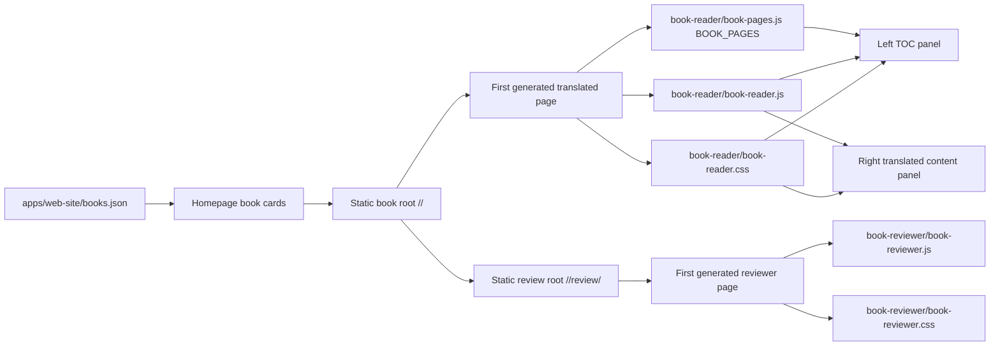

# Design: add-reader-book-page

## Architecture

## Decisions

### D1: Reuse `/<book>/` as the reader entry

Use the existing generated static book root as the per-book reader page. `/<book>/` already participates in homepage manifest generation, static site copy, and root redirect behavior, so a separate app route would duplicate content loading and risk breaking static URL compatibility.

Rejected alternative: create a new reader route that loads translated HTML into an app-level shell. That adds a second route/data path without a user requirement for a separate URL.

Addresses: `specs/reader-book-page/spec.md` Canonical per-book reader URL.

### D1A: Add `/<book>/review/` as the reviewer entry

Preserve reviewer/comment workflows in a separate generated static subtree under each book. The reviewer route should reuse the prior reviewer shell and generated translated HTML, while the reader root remains translated-only.

Rejected alternative: keep reviewer affordances hidden inside reader controls. That would blur the user-facing reader contract and make the two-page requirement harder to reason about.

Addresses: `specs/reader-book-page/spec.md` Per-book reviewer URL and Reviewer affordance preservation.

### D2: Keep `BOOK_PAGES` as the sole TOC data contract

The reader should continue building the full-book TOC from the generated `BOOK_PAGES` manifest. This preserves the existing `book-toc-sidebar` requirements for manifest order, relative links, current-page state, mobile reachability, and chapter grouping.

Rejected alternative: scrape or generate a richer OpenStax TOC. The existing manifest is already deployed with every generated book and is sufficient for the requested two-panel reader.

Addresses: `specs/reader-book-page/spec.md` Reader table of contents source.

### D3: Two panels means no persistent auxiliary reader panel

Desktop reader layout should contain only the TOC panel and the translated content panel as primary columns. Existing glossary/comment/utility behavior may be retained only if it is embedded into the content flow, a top utility control, or a non-persistent overlay that does not create a third primary panel.

Rejected alternative: keep an always-visible right utility panel. That conflicts with the user's explicit "only 2 panel" request.

Addresses: `specs/reader-book-page/spec.md` Two-panel desktop reader layout and Translated-only reader visibility.

### D4: Preserve hidden source blocks, but remove reader-facing bilingual affordances

Generated translated HTML may keep `eng hidden` blocks because they are part of the translation pipeline and may be used by tooling. The reader shell must not expose comparison/toggle/review controls, and hidden source blocks must remain non-visible in normal reading.

Rejected alternative: strip source blocks during reader generation. That would create unnecessary pipeline risk and could break review/export tooling assumptions.

Addresses: `specs/reader-book-page/spec.md` Translated-only reader visibility.

### D5: Do not concatenate full books into one page

Keep the current page-at-a-time generated HTML model. The left TOC provides full-book navigation, while the content panel loads one generated translated page at a time.

Rejected alternative: generate a single full-book reader page. That creates unbounded DOM growth, slower loads for large books, and duplicate navigation semantics.

Addresses: `specs/reader-book-page/spec.md` Reader content growth bound.

## Interfaces

### `BOOK_PAGES`

Reader assets continue consuming the generated global `BOOK_PAGES` array from `book-reader/book-pages.js`. The plan does not require changing the manifest shape.

### Reader Landmarks

The reader shell should expose stable accessible landmarks:

- TOC panel: `nav` or equivalent landmark with a clear label such as `Table of contents`.
- Content panel: `main` or equivalent landmark containing visible translated book content.
- Mobile TOC control: button with `aria-controls` pointing at the TOC panel and `aria-expanded` reflecting state.

## Design Constraints

- Static book URLs must remain relative and valid when `apps/web-site/books/<book>/` is copied to `dist/site/<book>/`.
- Canonical generated reader assets should be changed at their source, then generated sample output should be refreshed if tracked.
- Existing specs for `book-toc-sidebar`, `static-book-output`, and `homepage-book-manifest` remain authoritative and should not be weakened.
- The page-at-a-time model bounds reader DOM growth by one generated HTML page plus one `BOOK_PAGES` TOC manifest.

## Risk Map

| Component | Risk | Mitigation |
|---|---|---|
| Reader layout | Existing right-side utility panel conflicts with two-panel requirement | Task 1_1 removes or relocates persistent auxiliary panel behavior and E2E asserts only TOC/content primary panels |
| Reviewer route | Removing the old panel would break review/comment workflows | Task 1_1 preserves the old panel in separate reviewer assets and generated `/review/` pages; Task 1_2 adds E2E coverage |
| TOC | Relative links or current-page highlighting regress | Task 1_2 updates E2E coverage for TOC link navigation and current entry state using existing `BOOK_PAGES` behavior |
| Translated content | Source-language blocks become visible or focusable | Task 1_1 preserves hidden styling and Task 1_2 verifies source text/comparison controls are not visible in reader UI |
| Mobile reader | TOC drawer obscures content after navigation | Task 1_1 implements explicit `aria-expanded` state and close-after-navigation behavior; Task 1_2 verifies mobile reachability |
| Generated assets | Canonical and generated sample reader assets drift | Task 1_1 scope includes canonical assets and generated Entrepreneurship sample assets, with regeneration preferred over manual generated edits |
| Data scale | Single full-book DOM would grow with every page in a book | D5 forbids concatenation; reader growth is bounded to one page DOM plus `BOOK_PAGES` manifest length |
