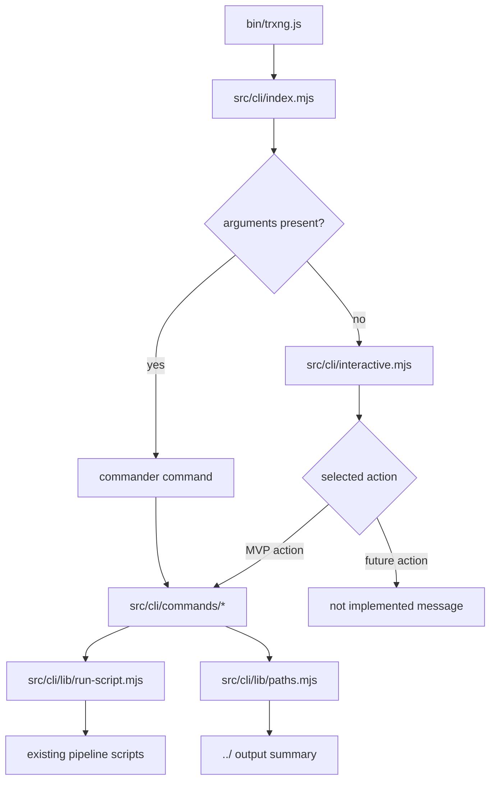

# Design: add-trxng-cli

## Decisions

### D1: Keep `bin/trxng.js` CommonJS and Load ESM CLI Modules Dynamically

Existing pipeline scripts use CommonJS `require()` and would break if the root package were switched to `"type": "module"`. The bin wrapper will remain a plain `.js` CommonJS executable and call `import('../src/cli/index.mjs')` to load the CLI implementation.

Rejected alternative: setting root `"type": "module"`. That matches modern Chalk/Inquirer examples, but it would force a wider migration of existing scripts and violates the MVP boundary.

### D2: Wrap Existing Scripts as Child Processes

The CLI will call current scripts with `spawn()` using argv arrays and `stdio: 'inherit'`. The CLI layer owns prompts, validation, confirmations, and path summaries; the existing scripts remain the execution engine.

Rejected alternative: refactoring scripts into reusable modules first. That is cleaner later but expands the MVP into behavior migration and mixed Node/Python refactoring.

### D3: Use Commander for Direct Commands and Inquirer for No-Arg Mode

`src/cli/index.mjs` will configure commander for direct command usage and detect no command arguments to launch the interactive flow. Interactive mode will use `@inquirer/prompts` and catch prompt cancellation so Ctrl+C exits cleanly.

Rejected alternative: building only a prompt menu. Direct commands are part of the target UX and make smoke verification possible without prompt automation.

### D4: Treat Non-MVP Actions as Visible Placeholders

The menu will show the full target action list, but translate, review, build preview, and deploy will print `This action is not implemented in the MVP yet.` without side effects. This preserves the target dashboard shape while keeping the first build limited to stable wrapper actions.

### D5: Centralize Repo and Book Paths

`src/cli/lib/paths.mjs` will derive the repo root from the CLI module location and compute sibling book paths as `../<book>`. Commands will use this helper for output summaries instead of embedding path math in each command.

## Architecture



## Target Layout

```text
bin/trxng.js
src/cli/index.mjs
src/cli/interactive.mjs
src/cli/commands/scrape.mjs
src/cli/commands/cleanup.mjs
src/cli/commands/terms.mjs
src/cli/commands/prep.mjs
src/cli/lib/run-script.mjs
src/cli/lib/paths.mjs
```

## Interfaces

### `runScript(scriptPath, args, options)`

- `scriptPath`: repo-root-relative script path.
- `args`: string argv array, never a shell string.
- `options.cwd`: defaults to repo root.
- `options.env`: merged with `process.env`.
- Behavior: spawns the command with inherited stdio, resolves on exit code 0, rejects with the non-zero exit code otherwise.

### Command Mapping

| CLI action | Underlying script | Notes |
|---|---|---|
| `scrape <book> <startUrl>` | `node agents/agent-scrape/scripts/skill-scrape.js <book> <startUrl>` | Existing link filter remains Entrepreneurship-specific |
| `cleanup <book>` | `node agents/agent-scrape/scripts/skill-cleanup.js <book>` | Interactive mode requires confirmation |
| `terms <book> --chapter <n|all>` | `node agents/agent-analyze/scripts/term-extract.js <book> <chapter>` | Current script defaults chapter to `all` when omitted; CLI requires explicit chapter/scope |
| `prep <book> --input <file> --output <file>` | `node agents/agent-translate/scripts/prep_html.js <input> <output>` | File-by-file only |

## Design Constraints

- Do not add root `"type": "module"` unless all existing CommonJS scripts are migrated or renamed.
- Do not run cleanup without an interactive confirmation in no-arg mode.
- Do not use `exec()` or `shell: true` for user-provided arguments.
- Do not claim generalized multi-book support beyond passing existing script arguments and showing selected book paths.

## Risk Map

| Component | Risk | Mitigation |
|---|---|---|
| Module format | Root ESM would break CommonJS scripts | D1 keeps bin CommonJS and CLI internals `.mjs` |
| Cleanup command | Deletes/re-downloads shared assets | D3/D4 require prompt flow; spec requires explicit cleanup confirmation |
| Script wrappers | Shell injection or broken quoting | D2 and `runScript` interface require argv arrays and no shell strings |
| MVP boundaries | Menu exposes unsupported actions | D4 mandates no-op placeholder message with no script execution |
| Book paths | CLI could imply unsupported multi-book pipeline | D5 centralizes path summaries and command mapping notes current single-book constraints |
| Derived output summary | Paths grow by number of books but are not persisted | Compute paths on demand from selected book; no collection/list endpoint or cached derived state added |
