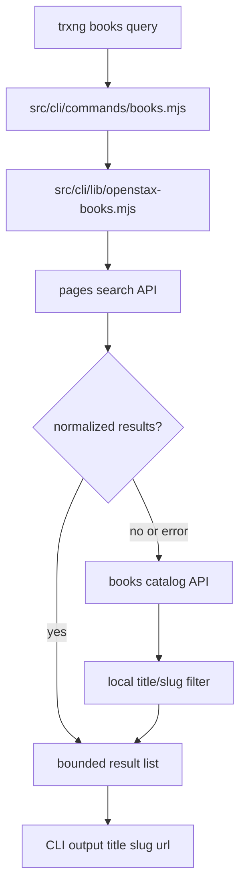

# Design: add-openstax-book-search

## Decisions

### D1: Add a Pure OpenStax Search Helper Under CLI Lib

Implement `searchOpenStaxBooks(query, options)` in `src/cli/lib/openstax-books.mjs`. The helper owns URL construction, fetch, response validation, normalization, local fallback filtering, and limit clamping.

Rejected alternative: putting network logic directly in the command module. That would make command output and search behavior harder to verify independently.

### D2: Use Pages Search First, Catalog Fallback Second

The primary source is the OpenStax Wagtail pages search endpoint with `type=books.Book`. If that request fails or yields no normalized results, fetch the full catalog endpoint and filter locally against title and slug.

Rejected alternative: catalog-only local filtering. It is simpler but requires fetching all books for every fuzzy search and ignores the endpoint designed for search.

### D3: Keep Search Read-Only and Separate From Scrape

`trxng books <query>` prints candidates and URLs only. It does not invoke `skill-scrape.js` or any pipeline script. Users can copy a returned URL into `trxng scrape` after choosing the correct edition.

Rejected alternative: auto-selecting the first result and scraping it. OpenStax search is fuzzy and can return multiple editions, so auto-selection risks scraping the wrong book.

### D4: Use Native `fetch` and No New Dependencies

Node 22 is available in this environment, and the CLI can use native `fetch`. No OpenStax SDK or HTTP dependency is required for this MVP.

## Architecture



## Target Layout

```text
src/cli/index.mjs
src/cli/commands/books.mjs
src/cli/lib/openstax-books.mjs
src/cli/lib/openstax-books.test.mjs
```

## Interfaces

### `searchOpenStaxBooks(query, options = {})`

- `query`: user-provided book name or partial title.
- `options.limit`: requested result count; default `10`, maximum `25`.
- `options.fetchImpl`: optional fetch function for tests.
- Returns: array of normalized results.

### Normalized Result

```js
{
  title: 'Biology 2e',
  slug: 'biology-2e',
  url: 'https://openstax.org/books/biology-2e/pages/1-introduction',
  source: 'pages' | 'catalog',
  locale: 'en'
}
```

### CLI Command

```text
trxng books <query> [--limit <n>]
```

The command prints a numbered list of results. Each item includes title, slug, and URL. If no results match, print `No OpenStax books found.`.

## Design Constraints

- Clamp `limit` to a maximum of 25 before constructing request URLs.
- Do not invoke `runScript()` from the book search command.
- Do not persist a cache in this change.
- Normalize catalog slugs that may arrive as `books/<slug>` into `<slug>` for CLI output.
- Prefer `webview_rex_link` from catalog results when available; otherwise build an OpenStax book URL from slug only if needed for display.

## Risk Map

| Component | Risk | Mitigation |
|---|---|---|
| External API | OpenStax endpoint shape changes | D1 isolates parsing; D2 adds fallback source; tests mock both shapes |
| Fuzzy matches | Wrong edition appears first | D3 prints candidates only and does not auto-scrape |
| Result list growth | Catalog grows over time | Spec caps result limit at 25 and defaults to 10 |
| Network failures | CLI command could crash noisily | Command should catch helper errors and print a concise failure message with non-zero exit |
| Terms/robots | Bulk crawling concerns | User-initiated bounded requests only; no persistent crawler or bulk scrape added |
