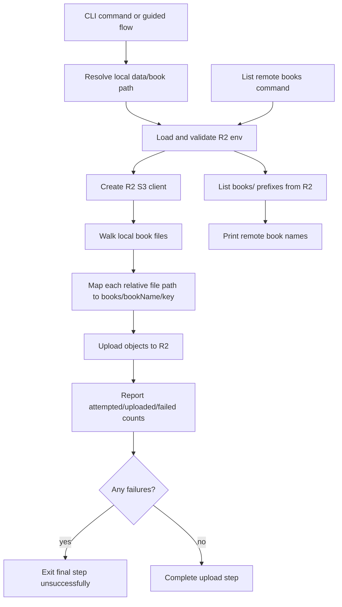

# Design: add-r2-book-upload

## Architecture



## Decisions

### D1: Keep local `data/<book>` as the working cache

R2 upload will operate after local scripts finish instead of making every script stream directly from R2. This preserves current script contracts and limits the change to remote persistence and visibility.

Rejected alternative: remote-first pull/push around every stage. That is the likely long-term model, but it would force broader changes across scrape, cleanup, prep, translate, review, and export at once.

### D2: Use `books/<bookName>/` as the remote root prefix

Every local file under `data/<bookName>/` maps to `books/<bookName>/<relativePath>`. This matches the user's expectation that each book has a folder by name while leaving room for future bucket-level namespaces.

Rejected alternative: storing at `<bookName>/...` at bucket root. Root book prefixes are shorter but leave less room for future non-book objects such as global manifests, temp uploads, or user-level namespaces.

### D3: Centralize R2 config and client creation

All upload/list paths should go through one R2 config loader and client factory that validates env vars and masks secrets in errors. This avoids drift between manual upload and guided-flow upload behavior.

Rejected alternative: read env vars directly in each command. That would duplicate validation and increase the risk of logging secrets.

### D4: Do not require delete permission in MVP

Normal upload, overwrite, and list behavior only needs read/write/list permissions. Delete is intentionally excluded so the user's R2 token can be safer while translated books are versioned or overwritten by key.

Rejected alternative: include delete for a full sync/prune command. Pruning is useful later, but it changes the safety model and should be an explicit maintenance feature.

### D5: Share upload implementation between CLI command and guided final step

The manual upload command and guided flow should call the same upload function so result summaries, key mapping, and error behavior stay identical.

Rejected alternative: shell out from the guided flow to the upload command. A shared function is easier to test and avoids command output parsing.

## Interfaces

### R2 config contract

Inputs from environment:

```text
R2_ACCESS_KEY_ID
R2_SECRET_ACCESS_KEY
R2_BUCKET
R2_ACCOUNT_ID or CLOUDFLARE_ACCOUNT_ID
```

Derived endpoint:

```text
https://<account-id>.r2.cloudflarestorage.com
```

### Upload result contract

```ts
type UploadBookResult = {
  bookName: string;
  prefix: string;
  attempted: number;
  uploaded: number;
  failed: Array<{ path: string; key: string; error: string }>;
};
```

### Remote list result contract

```ts
type RemoteBook = {
  name: string;
  prefix: string;
};
```

## Design Constraints

- The upload path must not print secret env values.
- The upload path must skip directories and upload only regular files.
- The first implementation should not delete remote objects.
- The guided flow must not remove or roll back local translated files if upload fails.

## Risk Map

| Component | Risk | Mitigation |
|---|---|---|
| R2 config | Missing or wrong credentials produce confusing failures | Task 1 centralizes env validation with exact missing variable names and masked secrets |
| Object keys | Different commands produce different remote paths | D2 and D5 require one mapper used by both manual and guided upload |
| Upload loop | Many files grow with book size and object count | Growth axis: number of files under `data/<book>`; bound: only one selected book per upload command, not the full bucket |
| Failure handling | Partial uploads look successful | Upload result contract includes failed file list and non-zero/failing command outcome when failures exist |
| Permissions | Accidentally requiring delete blocks safer tokens | D4 and specs prohibit delete permission for MVP operations |
| Guided flow | R2 outage could obscure successful local translation | Final step reports remote failure separately and preserves local outputs |
