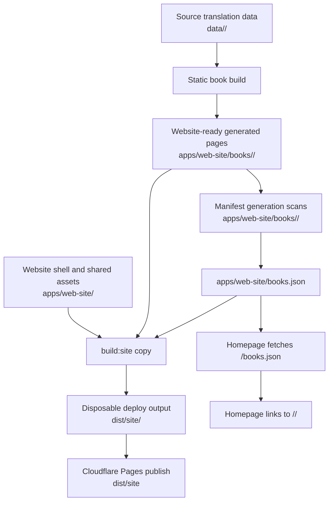

# Design: rehome-static-book-site

## Architecture



## Target Layout

```text
data/<book>/
  glossary.csv
  translated/
  chapter-*/
  assets/
  ...source translation data and artifacts...

apps/web-site/
  index.html
  index.css
  assets/
  functions/
  books.json
  books/
    <book>/
      index.html
      book-reader/
      ...website-ready generated static book pages...

dist/site/
  index.html
  index.css
  books.json
  assets/
  functions/
  <book>/
    index.html
    ...copied website-ready static book pages...
```

## Interfaces

### `apps/web-site/books.json`

`build:site` regenerates this file before copying `apps/web-site` to `dist/site`. The deployed runtime sees the copied file at `/books.json`.

```json
[
  {
    "slug": "entrepreneurship",
    "title": "Entrepreneurship",
    "url": "/entrepreneurship/"
  }
]
```

Homepage rendering must require only `slug` and `url`; optional display fields such as `title`, `author`, or `cover` may be included when available.

## Decisions

### D1: Split source data from website-ready generated pages

`data/<book>/` remains the source translation data/artifact root. `apps/web-site/books/<book>/` becomes the default static book build output because these pages are part of the generated website, not reusable translation source data. The rejected alternative is continuing to generate into `data/<book>/.html/`, which keeps deploy artifacts nested under source data and conflicts with the requested flow.

### D2: Generate the manifest in the website source tree

`apps/web-site/books.json` is generated by scanning generated book folders under `apps/web-site/books/<book>/`. `dist/site/books.json` is only the copied deploy artifact. The rejected alternative is generating only `dist/site/books.json`, which would leave the homepage manifest absent from the website source tree and obscure what will be deployed.

### D3: Copy the website tree with junk-only exclusions

`build:site` copies the app shell from `apps/web-site` into `dist/site` after regenerating the manifest, excluding the `books` container from the shell copy, then flattens each `apps/web-site/books/<book>/` generated folder into `dist/site/<book>/`. It excludes `node_modules`, `.wrangler`, `dist`, and equivalent build/dev junk. The rejected alternative is keeping generated book folders directly under `apps/web-site/<book>/`, which clutters the app shell root.

### D4: Keep deploy output disposable

`dist/site` remains fully removed and rebuilt by `build:site`, and Cloudflare Pages continues to publish `dist/site`. No source data should be edited inside `dist/site` because all durable inputs live under `data/<book>` or `apps/web-site`.

### D5: Treat `data/<book>/.html` as legacy generated output

The old `.html` location is no longer required for normal site deployment. Cleanup may remove only `data/<book>/.html/` because it is an owned generated directory; cleanup must not delete translated files, glossary, chapter artifacts, or assets under `data/<book>`.

## Design Constraints

- Book folder discovery under `apps/web-site/books` must require generated-book markers such as `index.html` plus `book-reader/book-pages.js`, and the matching `data/<book>` source directory must exist.
- The homepage fetch path remains `/books.json`; relative paths are not required for the deployed Pages site.
- `build:site` may overwrite `apps/web-site/books.json` because it is a generated source-tree manifest, but it must not rewrite generated book HTML.
- The implementation must not introduce a new dependency or require Cloudflare credentials for local `build:site`.

## Risk Map

| Component | Risk | Mitigation |
|---|---|---|
| Static book output | Relative links generated for `.html` may break when output lands under `apps/web-site/books/<book>` and deploys to `dist/site/<book>`. | Task 1_1 must preserve current relative URL rewrites and Task 3_1 must verify navigation from `dist/site/<book>/`. |
| Manifest generation | Scanning `apps/web-site/books/*` can include orphan generated folders. Growth axis: number of generated book folders; bound: one filesystem scan per `build:site`. | D2 and Task 2_1 require generated-book markers and a matching `data/<book>` source directory. |
| Site copy | Copying `apps/web-site` recursively can include dev/build junk or recursively copy deploy output. Growth axis: files under app source; bound: one deploy build copy. | D3 and Task 2_1 require an explicit junk-only exclusion list including `node_modules`, `.wrangler`, and `dist`. |
| Generated book copy | Book folders under `apps/web-site/books` could be served under `/books/<book>/` instead of the public `/<book>/` route. | D3 and Task 3_1 require flattening generated book folders into `dist/site/<book>/`. |
| Legacy output cleanup | Removing `data/<book>/.html` could accidentally remove source data if implemented broadly. | D5 and Task 1_1 constrain cleanup/migration to the exact `.html` generated directory only. |
| Deploy target | Scripts could accidentally publish `apps/web-site` directly after making it website-complete. | D4 and Task 3_1 verify deploy config/scripts still target `dist/site`. |
