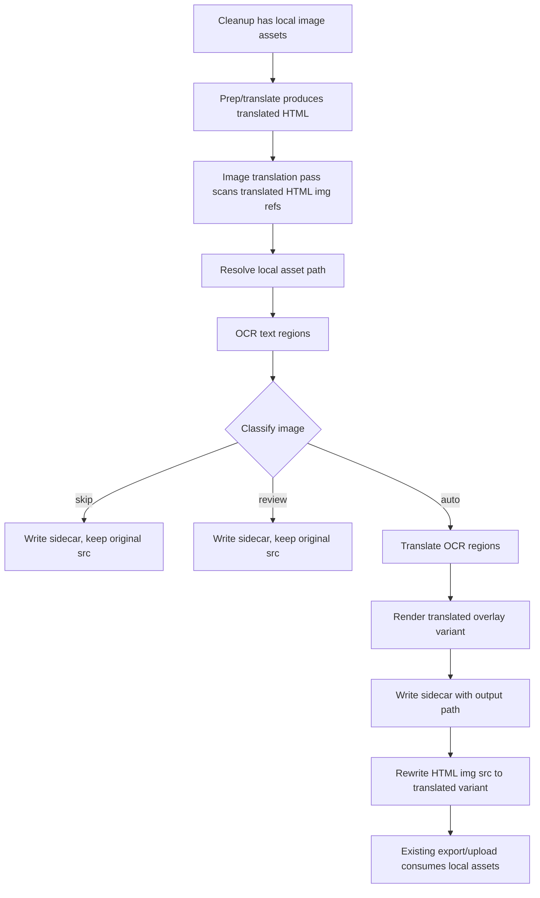

# Design: add-image-translation

## Architecture



## Decisions

### D1: Use a separate image translation pass after text translation

Run image processing after translated HTML exists and local assets are available. This keeps text translation behavior stable and lets the pass rewrite only selected `` references in the already-translated file.

Rejected alternative: modifying `prep_html.js` or the main fragment translator to process images inline. Inline processing would mix independent failure modes and make it harder to preserve conservative per-image fallback.

### D2: Use OCR plus local overlay as the default implementation

Use `tesseract.js` to detect text regions and `sharp` to render translated SVG/text overlays into generated image variants. This stays in the repo's Node script model and avoids introducing a separate Python runtime for the first version.

Rejected alternative: Python `PaddleOCR` plus Pillow/OpenCV. It is likely stronger for layout detection, but it adds a second runtime/dependency setup that is larger than necessary for the initial implementation.

### D3: Preserve originals and write translated variants beside assets

Generated variants should live under the existing book asset tree, in a deterministic translated subdirectory such as `assets/translated/<source-stem>.vi.<ext>`, with sidecars such as `assets/translated/<source-stem>.image-translation.json`. Original asset files are never overwritten.

Rejected alternative: replacing downloaded assets in place. In-place mutation would make review, rollback, and failure recovery unsafe.

### D4: Classifier is conservative by default

Auto-translate only images with enough OCR text, acceptable confidence, and low estimated Vietnamese overflow. Skip likely photos/decorative images. Queue ambiguous images for review and leave their HTML unchanged.

Rejected alternative: auto-translate every OCR-positive image. That would create visible errors on photos, charts, equations, and hard layouts.

### D5: Sidecar metadata is the review contract

Each processed image writes a JSON sidecar containing source/output paths, decision, reason, OCR boxes, source text, Vietnamese translation, confidence, and overflow flags. Console output can summarize counts, but sidecars are the durable review/debug artifact.

## Interfaces

### CLI

```text
node agents/agent-translate/scripts/translate-images.js <translated-html-file|chapter-number|all> [bookName]
```

Default `bookName` is `entrepreneurship` to match the current repo convention. The command processes translated HTML under `../<bookName>/chapter-*/05-translated/` for chapter/all inputs and individual files when given a file path.

### Sidecar Shape

```json
{
  "sourceImage": "../entrepreneurship/assets/example.png",
  "htmlFile": "../entrepreneurship/chapter-1/05-translated/page.html",
  "decision": "skip|auto|review|error",
  "reason": "low-text-density",
  "outputImage": "../entrepreneurship/assets/translated/example.vi.png",
  "ocr": [
    { "text": "Customers", "confidence": 92, "bbox": { "x": 10, "y": 20, "w": 120, "h": 30 } }
  ],
  "translations": [
    { "source": "Customers", "target": "Khách hàng", "bbox": { "x": 10, "y": 20, "w": 120, "h": 30 }, "overflow": false }
  ]
}
```

## Design Constraints

- Image processing MUST be per-image fault tolerant; one failure cannot abort the whole translated file unless the file itself cannot be read/written.
- Rewritten image URLs MUST remain relative and compatible with static output and DOCX export.
- The first implementation SHOULD use thresholds as local constants or CLI options, not persisted configuration.
- Generated overlays SHOULD prefer readable Vietnamese text over exact font matching.

## Risk Map

| Component | Risk | Mitigation |
|---|---|---|
| Image processing set | Growth axis: number of `` references per selected HTML/chapter; unbounded all-book runs could be slow | Process files sequentially with per-image summaries; keep `chapter-number` and single-file modes for narrow verification |
| OCR/render dependencies | `tesseract.js` and `sharp` increase install/runtime surface | Isolate usage in `translate-images.js`/helper module and verify with a single fixture command before guided-flow wiring |
| Classifier | Real-life photos with incidental text may be modified | D4 conservative thresholds; require clustered text density and confidence for `auto`, otherwise `skip` or `review` |
| Layout | Vietnamese translations overflow boxes | Mark overflow as `review`; cap auto rendering by max line count/font-size floor |
| HTML path rewriting | Broken relative paths can affect site/DOCX output | Resolve source asset from HTML location and compute rewritten `src` relative to the same HTML file; verify with fixture HTML |
| Translation failures | API/OCR/render failures could corrupt existing translated files | Requirement: Conservative Failure Behavior; write HTML only after successful generated variant and path rewrite |
