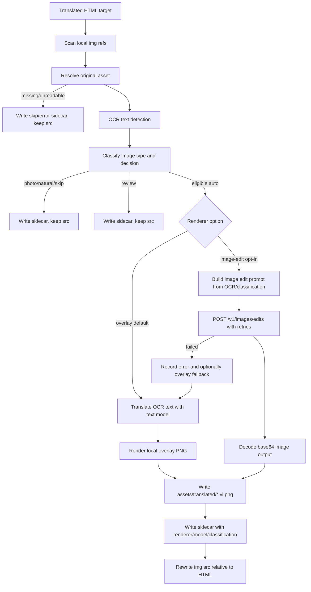

# Design: add-image-edit-renderer

## Architecture



## Decisions

### D1: Keep overlay as default and make image-edit opt-in

The `overlay` renderer remains the default for existing CLI and guided runs. `image-edit` is selected only through `--renderer image-edit` or the guided prompt, and overlay remains the fallback path when image-edit generation fails and OCR translation data is available.

Rejected alternative: switching all auto images to image-edit. That would change cost, latency, and hallucination risk for current users and conflicts with the requirement to keep OCR overlay as fallback/default.

### D2: Reuse OCR before renderer selection

The flow keeps OCR detection as the first content-bearing signal. OCR text, bounding boxes, confidence, and density feed classification, prompt construction, overlay rendering, and sidecar metadata.

Rejected alternative: sending every referenced image to image-edit classification/generation. That would spend API calls on photos/decorative assets and weaken conservative skip behavior.

### D3: Add image type classification as a separate sidecar field

The classifier should keep the existing processing decision (`skip`, `auto`, `review`, `error`) and add a `classification` object or field that records the image type such as `diagram`, `table`, `chart`, `statistics`, `screenshot`, `labeled-illustration`, `photo`, `natural`, or `unknown`. Eligibility is positive-list based: only the required non-photo classes can translate automatically.

Rejected alternative: overloading the existing `decision` field with image types. That would make it harder to distinguish workflow action from content category during review.

### D4: Implement image edits through the existing direct OpenAI endpoint style

Use the repository's existing direct OpenAI request pattern for the new `/v1/images/edits` call, with native multipart form data and explicit retry handling around transient statuses/network errors. The renderer reads `IMAGE_TRANSLATION_IMAGE_MODEL`, defaults to `gpt-image-2`, treats GPT image output as base64, and writes decoded bytes to `.vi.png`.

Rejected alternative: adding the OpenAI SDK only for image edits. It is viable, but a direct endpoint call is a smaller change if the existing translation scripts already use direct HTTP calls.

### D5: Rewrite HTML only after durable translated PNG and sidecar data are available

Both renderers must preserve originals, write generated assets under `assets/translated/`, and only update `img src` after successful output. Missing original assets, OCR errors, API errors, or decode failures record sidecar/summary data and leave the original reference unchanged.

Rejected alternative: updating HTML before render completion and relying on cleanup on failure. That risks broken image references in translated chapters.

## Interfaces

### CLI

```text
node agents/agent-translate/scripts/translate-images.js <translated-html-file|chapter-number|all> [bookName] [--renderer overlay|image-edit]
```

`overlay` is the default when omitted. Invalid renderer values fail before image processing starts.

### Guided Flow

The guided `cyberkbooks` translate flow prompts for image renderer selection before running the image translation step. The default option is `overlay`.

### Configuration

```text
IMAGE_TRANSLATION_IMAGE_MODEL=gpt-image-2
```

The image edit renderer uses this value for `/v1/images/edits`. The text translation model configuration remains separate and unchanged.

### Sidecar Additions

```json
{
  "decision": "skip|auto|review|error",
  "renderer": "overlay|image-edit",
  "model": "gpt-image-2",
  "classification": {
    "type": "diagram|table|chart|statistics|screenshot|labeled-illustration|photo|natural|unknown",
    "eligible": true,
    "reason": "ocr-clustered-diagram-text"
  },
  "retries": {
    "attempts": 1,
    "transientFailures": 0
  }
}
```

For `overlay`, `model` may remain the existing text model if already recorded or be omitted when not applicable. For skips/errors, `classification`, `renderer`, and `reason` should still be present when the data is known.

## Design Constraints

- Image edit prompts must explicitly preserve non-text visual content, layout, dimensions, colors, icons, lines, and chart geometry while translating visible English text to Vietnamese.
- The classifier must skip `photo`, `natural`, and `unknown` unless existing OCR/classification signals clearly match the positive eligible list.
- The implementation must not require delete permissions or mutation of original asset files.
- Per-image retry handling must not turn validation/model errors into repeated calls.

## Risk Map

| Component | Risk | Mitigation |
|---|---|---|
| Eligible image set | Growth axis: number of OCR-positive images in selected file/chapter/all; all-book image-edit runs can be slow and costly | Keep `overlay` default, make `image-edit` opt-in, and verify on fixture plus one chapter before broader runs |
| Image edit output | Generated images may drift from original chart/diagram geometry | D1/D2/D4 require OCR-gated eligibility and strict preserve-layout prompt; sidecars record renderer/model for review |
| Photo classification | OCR-positive real-life photos could be translated incorrectly | D3 positive-list eligibility and spec scenario require photos/natural images to skip despite OCR text |
| OpenAI API failures | Rate limits/network errors/model errors can fail individual images | D4 retry transient failures only; D5 leaves HTML unchanged and records error sidecar after failure |
| Asset rewriting | Broken relative paths can affect static site or DOCX output | D5 requires write-before-rewrite and reuse existing relative path rewrite behavior; fixture verification checks HTML `src` |
| Missing originals | Existing HTML may reference absent assets | D5 records skip/error and preserves original `src` without throwing per-image fatal errors |
