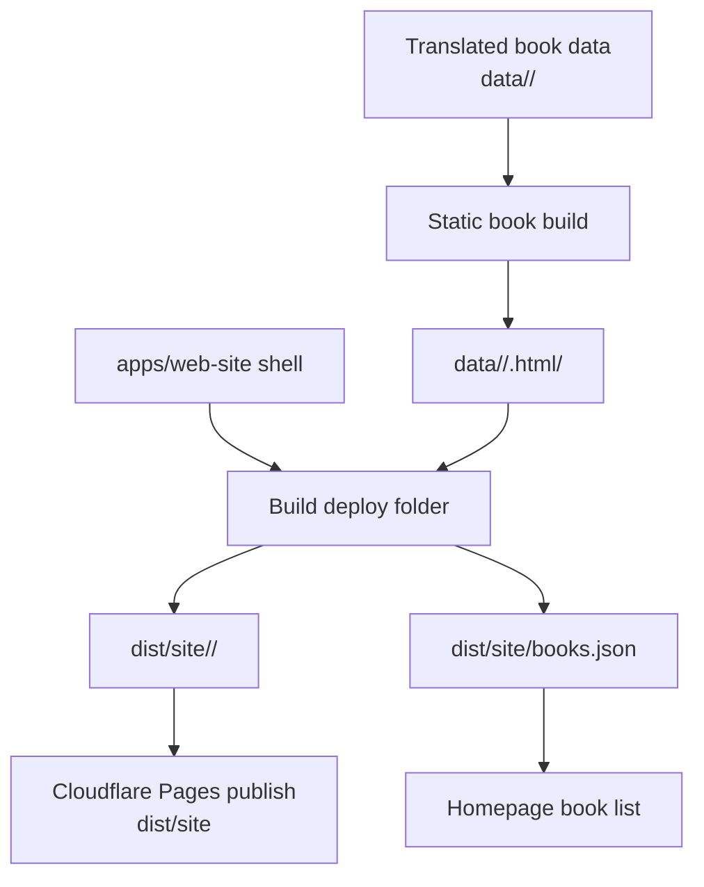

# Design: build-static-book-deploy

## Architecture



## Target Layout

```text
data/<book>/
  .html/
    index.html
    ...static reader files...

apps/web-site/
  index.html
  functions/
  schema.sql
  ...shell assets only...

dist/site/
  index.html
  books.json
  functions/
  <book>/
    index.html
    ...copied static reader files...
```

## Interfaces

### `books.json`

The initial manifest is a static JSON file generated into `dist/site/books.json`.

```json
[
  {
    "slug": "entrepreneurship",
    "url": "/entrepreneurship/"
  }
]
```

Builders may include extra display fields such as `title` when the data is already available, but homepage rendering must only require `slug` and `url`.

## Decisions

### D1: Keep generated book source under `data/<book>`

Generated book HTML is produced into `data/<book>/.html/` and copied from there to deployment. This follows the existing data-root convention and rejects making `apps/web-site/entrepreneurship` canonical, which the user explicitly disallowed.

### D2: Assemble deployment into `dist/site`

Cloudflare Pages publishes a built artifact folder, not the mutable app source folder. This avoids polluting `apps/web-site` with generated book files and gives deployment a single inspectable output.

### D3: Treat `apps/web-site` as a shell source

The assembly script copies shell files, functions, and static assets from `apps/web-site`, but generated book folders are excluded or ignored as canonical inputs. This keeps current app code usable while allowing old generated subtrees to be removed later.

### D4: Start with static `books.json`

The homepage reads a manifest from `books.json` first. A D1-backed API is rejected for this change because it adds schema, migration, and runtime concerns not needed to prove the deploy layout.

### D5: Preserve manifest-compatible API migration

The homepage should consume an array of book entries with at least `slug` and `url`, whether it comes from `books.json` now or an API later. This keeps the future D1 move behind the same data shape.

## Design Constraints

- `data/<book>/.html` is a generated directory even though it has a dot-prefixed name; copy and cleanup code must not skip it accidentally.
- Build scripts must avoid destructive cleanup outside their owned output directories: `data/<book>/.html/` for static book generation and `dist/site/` for deploy assembly.
- Existing R2 upload behavior uploads every regular file under `data/<book>`; if `.html` should not go to R2 in a future flow, that must be a separate scoped change.

## Risk Map

| Component | Risk | Mitigation |
|---|---|---|
| Static book output | Relative links work in `data/<book>/.html/` but break after copying to `dist/site/<book>/`. | Task 1_1 must verify generated output after copying via the deploy-folder check in Task 2_1. |
| Website shell copy | Generated book folders inside `apps/web-site` are copied as stale source artifacts. | D3 requires explicit exclusion/ignore of generated book folders; Task 2_1 acceptance checks copied output comes from `data/<book>/.html/`. |
| Manifest generation | `books.json` grows with number of local books. Growth axis: number of generated local books; bound: one manifest entry per copied book. | Generate manifest by scanning selected/local `data/*/.html` directories once during deploy assembly; no runtime hot path. |
| Homepage loading | Homepage becomes blank if `books.json` fetch fails. | Task 3_1 must include a user-visible fallback/error state for manifest load failure. |
| Deploy target | Pages command still publishes `apps/web-site`. | Task 4_1 acceptance requires deploy command/config publishes `dist/site/`. |
