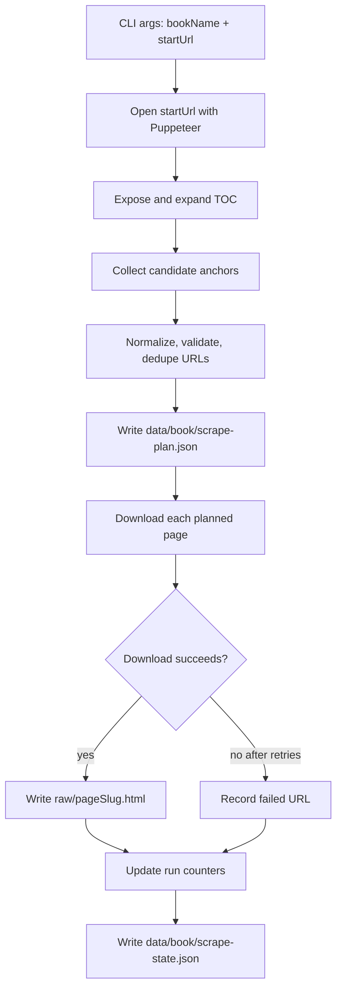

# Design: improve-book-scrape

## Architecture



## Decisions

### D1: Keep `skill-scrape.js` as the user-facing entrypoint

The approved direction is to update the existing script instead of introducing a new orchestrator. This preserves the current command surface and avoids forcing users to learn a second scrape command while fixing the incomplete discovery behavior.

Rejected alternative: adding a new `scrape-book.js` now. That is cleaner long-term, but it expands scope and duplicates responsibility before the existing script is trustworthy.

### D2: Use plan-first execution

The scraper should discover and validate all links before downloading any page. Writing `scrape-plan.json` before download gives the user a durable artifact to inspect and makes incomplete discovery visible instead of blending discovery and download into one opaque loop.

Rejected alternative: immediately downloading links as they are discovered. That is simpler but makes it harder to audit whether the whole book was discovered.

### D3: Validate URLs with strict OpenStax book namespace rules

Only normalized absolute URLs under `https://openstax.org/books/<bookName>/pages/` should enter the plan. This avoids accidental crawl drift into navigation, marketing, account, or unrelated book pages.

### D4: Preserve flat raw output layout

The script should continue writing `data/<bookName>/raw/<slug>.html`. Cleanup already supports this layout when run without a chapter argument, and path standardization is a separate change.

### D5: Treat AI as out of scope for this scraper change

The scraper should solve full-book acquisition with deterministic DOM discovery, validation, manifesting, and retry behavior. AI-assisted book search and autonomous loop decisions can be planned later after the deterministic scrape path is reliable.

## Interfaces

### CLI

```text
node agents/agent-scrape/scripts/skill-scrape.js <bookName> <startUrl>
```

Existing examples remain valid. The script still exits with a usage message when either argument is missing.

### `scrape-plan.json`

```json
{
  "bookName": "entrepreneurship",
  "startUrl": "https://openstax.org/books/entrepreneurship/pages/1-introduction",
  "generatedAt": "2026-07-16T00:00:00.000Z",
  "totalPages": 0,
  "pages": [
    {
      "url": "https://openstax.org/books/entrepreneurship/pages/1-introduction",
      "fileName": "1-introduction.html"
    }
  ]
}
```

### `scrape-state.json`

```json
{
  "bookName": "entrepreneurship",
  "status": "completed",
  "startedAt": "2026-07-16T00:00:00.000Z",
  "finishedAt": "2026-07-16T00:00:00.000Z",
  "totalPages": 0,
  "downloaded": 0,
  "skipped": 0,
  "failed": 0,
  "failures": []
}
```

## Design Constraints

- The change must not require new npm dependencies.
- The script should use existing dependencies already available to the repo, especially Puppeteer plus Node built-ins.
- TOC expansion should be tolerant of selector changes by using multiple generic signals for expandable controls and count-based convergence.
- The fallback behavior must not synthesize likely chapter URLs. Only discovered and validated links may be downloaded.

## Risk Map

| Component | Risk | Mitigation |
|---|---|---|
| TOC expansion | OpenStax changes selectors or hides links behind different controls | Implement expansion using broad button/summary/aria-expanded detection plus repeated anchor count stabilization; verify manually against Entrepreneurship |
| Link validation | Broad discovery captures non-content links | Enforce D3 strict namespace validation before adding URLs to `scrape-plan.json` |
| Download loop | One bad page aborts the whole book scrape | Implement D2/D3 plan execution with retry and per-page failure tracking in `scrape-state.json` |
| Output data scale | Full-book raw output grows with number of pages in the book; bounded by TOC size | Bound downloads to `scrape-plan.json.pages.length`; no recursive crawling beyond validated plan |
| Downstream compatibility | Later scripts may expect different folder layouts | Preserve D4 `data/<bookName>/raw` layout and avoid touching cleanup/review/archive scripts |
