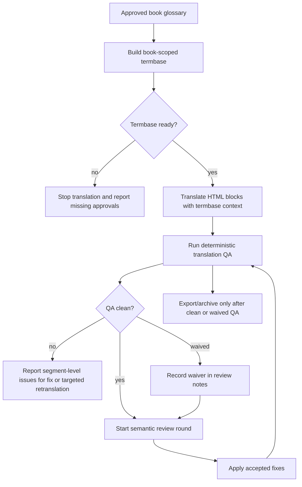

# Design: improve-translation-quality-flow

## Architecture



## Decisions

### D1: Use A Local Book-Scoped Termbase Instead Of Vendor Glossary Resources

The first implementation should generate a local termbase JSON from the approved glossary and optional book-level quality config. This keeps the flow provider-agnostic and reviewable in git while still allowing future migration to DeepL/Google/Amazon glossary APIs.

Rejected alternative: depend on vendor glossary resources now. That could improve model-side terminology enforcement but introduces credentials, provider-specific limits, and still would not detect mixed bilingual fragments.

### D2: Separate Hard Terms From Soft Phrases

Hard terms are exact blocking requirements: if the source appears in a block, the approved target must appear in the translation unless the segment is waived. Soft phrases are prompt guidance and review hints, not exact blockers, because Vietnamese phrasing can vary by sentence.

This addresses `franchise` and `franchisee` as strict domain terms while allowing longer headings and phrases such as `Types of Entrepreneurs` to be enforced when explicitly marked hard, or guided when marked soft.

### D3: Quality Checks Run On Parsed Vietnamese Blocks, Not Raw HTML

The QA command should parse bilingual HTML and inspect only `.vn.visible` text content after stripping tags, URLs, code-like placeholders, and protected tokens. This prevents false positives from hidden English source blocks and markup.

Rejected alternative: scan raw translated HTML. Raw scans will flag intentional `eng hidden` source text and HTML attributes, creating noisy reports.

### D4: Gate Review And Export, But Allow Explicit Waivers

Automated QA must pass before a review/export step is considered complete. If a false positive or intentional exception remains, the operator must record a waiver in the generated QA/review output rather than silently bypassing the gate.

### D5: Preserve Existing CLI Behavior While Avoiding New Single-Book Hardcoding

New termbase and QA commands should accept `bookName` and file/chapter inputs. They may default to existing Entrepreneurship conventions only where current scripts already do, but the new logic must not bake in new `../entrepreneurship` assumptions.

## Interfaces

### Termbase JSON

```ts
type Termbase = {
  bookName: string;
  sourceGlossary: string;
  generatedAt: string;
  hardTerms: Array<{
    source: string;
    target: string;
    variants?: string[];
    caseSensitive?: boolean;
  }>;
  softPhrases: Array<{
    source: string;
    target: string;
    variants?: string[];
  }>;
  protectedTerms: string[];
  allowlist: string[];
};
```

### QA Issue Shape

```ts
type TranslationQualityIssue = {
  file: string;
  blockId?: string;
  severity: "error" | "warning";
  type: "missing-term" | "source-echo" | "english-leak" | "mixed-bilingual";
  source?: string;
  expected?: string;
  actual: string;
  message: string;
};
```

## Design Constraints

- No new external dependency is required for the first implementation.
- The QA command should exit non-zero on `error` issues so scripts can use it as a gate.
- Verification must use narrow script invocations because the repo has no root lint/test/typecheck command.
- The plan must preserve append-only review history in `06-reviews`.

## Risk Map

| Component | Risk | Mitigation |
|---|---|---|
| Termbase growth | A future book can have many glossary entries, but lookup remains bounded by the current file/chapter text being translated or checked. | Build per-book termbase once and filter applicable terms per block/file before prompt/QA use. |
| English leakage detection | Proper nouns, acronyms, URLs, and hidden English blocks can cause false positives. | D3 requires parsing `.vn.visible` text only and stripping protected/allowlisted tokens before scanning. |
| Hard-term enforcement | Exact matches can reject fluent contextual translations. | D2 separates hard terms from soft phrases and requires waivers for intentional exceptions. |
| Existing single-book assumptions | Adding quality scripts could deepen Entrepreneurship-only coupling. | D5 requires `bookName` support and forbids new hardcoded Entrepreneurship-only paths. |
| Review loop churn | QA can repeatedly fail after manual fixes. | Gate order routes accepted review fixes back through the same deterministic QA before export. |
